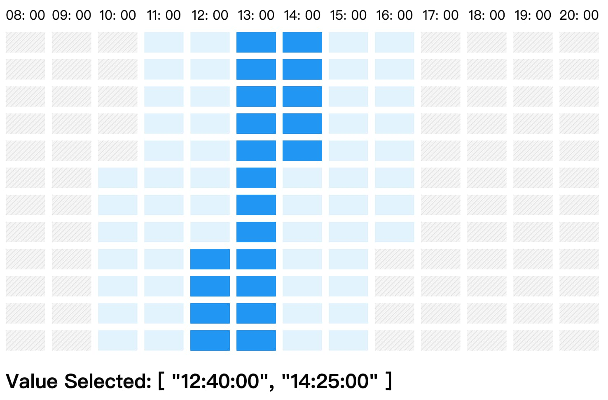

# GridPicker (Time Blocks) 

## Time select by time range



### props supported
```
timeRange: {
  type: Array,
  default() {
    //  example(unit === 'hour')
    return ["08:00:00", "20:00:00"];
  },
},
disabledRanges: {
  type: Array,
  default() {
    // disabled ranges: [{ from, to }, ...]
    return [];
  },
},
limit: {
  type: Number,
  default() {
    // selectable range by unit
    return 2;
  },
},
unit: {
  type: String,
  default() {
    // ['hour'] supported currently, ['week', 'day', 'minute', ...] to be supported!
    return "hour";
  },
},
divide: {
  // split unit into equal parts, ensure the part be an integer
  type: Number,
  default() {
    return 4;
  },
},
value: {
  type: Array,
  default() {
    // return (when unit === 'hour'): ["08:00:00", "20:00:00"];
    return [];
  },
},
```
### how to use

```
import GridTimePicker from 'vue-grid-picker'

<GridTimePicker
  :value="['14:00:00', '16:00:00']"
  :timeRange="['08:00:00', '19:00:00']"
  :disabledRanges="[{from: '10:00:00', to: '12:00:00'}]"
  @change="(selectedValue) => console.log(selectedValue)" 
/>

```
